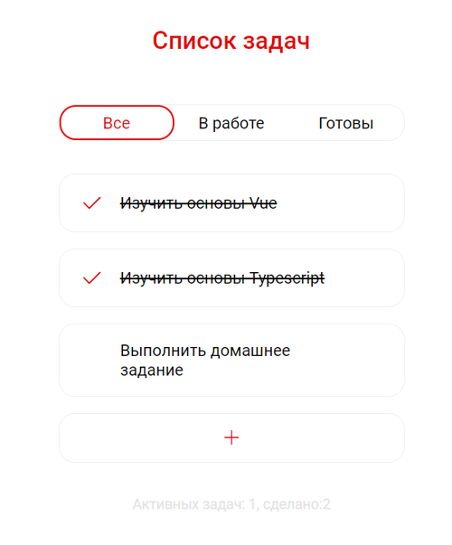

# Простой список задач - [Demo](https:///)

```
Просто Vue приложение написано на TypeScript.
```

<br />
<div align="center">
  
</div>
<br />

## Команды

### Для установки пакетов используйте команду

```
npm install
```

### Запуск сервера для разработки

```
npm run serve
```

### Сборка проекта без оптимизации

```
npm run build
```

### Запуск ES Lints

```
npm run lint
```
